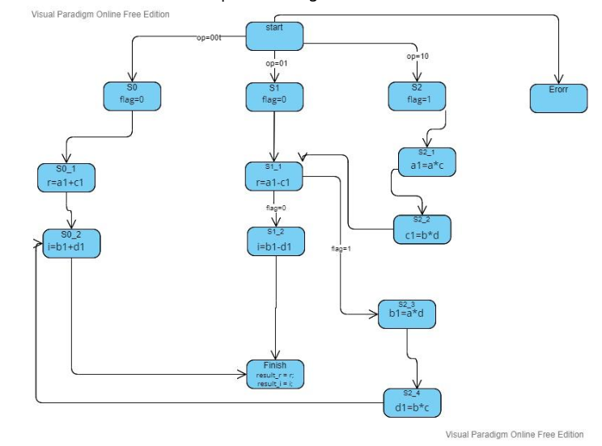
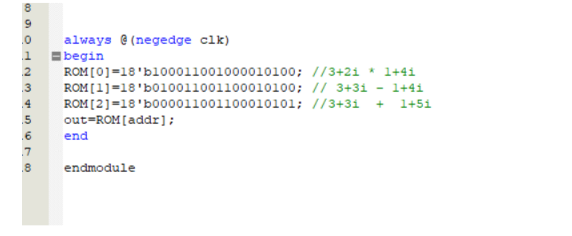
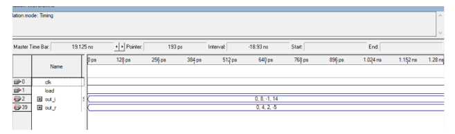

# ALU for Complex Numbers

This project implements an Arithmetic Logic Unit (ALU) designed to perform operations on complex numbers. The ALU can handle addition, subtraction, and multiplication of complex numbers. The project consists of three main modules: `ALU`, `ROM`, and `run`.

## Features

- **Complex Number Operations**: The ALU supports addition, subtraction, and multiplication on complex numbers.
- **State Machine Control**: A finite state machine (FSM) is used to control the flow of operations based on the opcode.
- **Modular Design**: The design is split into multiple modules (`ALU`, `ROM`, and `run`) for better scalability and reusability.

## Project Structure

### 1. ALU Module (`ALU`)

The `ALU` module performs arithmetic operations on complex numbers based on the opcode provided in the input.

#### Inputs:
- `data_in [17:0]`: Input data which includes the opcode and the real and imaginary parts of the two complex numbers.
- `load`: A signal to load the input data.
- `clk`: Clock signal.

#### Outputs:
- `result_r [7:0]`: Real part of the result.
- `result_i [7:0]`: Imaginary part of the result.

#### Operations:
- **Addition** (`opcode = 00`): Adds two complex numbers.
- **Subtraction** (`opcode = 01`): Subtracts the second complex number from the first.
- **Multiplication** (`opcode = 10`): Multiplies two complex numbers.

#### Finite State Machine (FSM):
The FSM controls the flow of operations inside the ALU, moving through different states (`s0`, `s1`, `s2`, etc.) to calculate the result based on the opcode.

### 2. ROM Module (`ROM`)

The `ROM` module stores pre-defined operations for the ALU. Each address in the ROM stores a binary instruction containing the opcode and the operands for the ALU.

#### Inputs:
- `addr [4:0]`: Address to read from the ROM.
- `clk`: Clock signal.

#### Outputs:
- `out [17:0]`: Data output from the ROM.

### 3. run Module (`run`)

The `run` module combines the `ROM` and `ALU` modules. It generates complex number operations using data from the ROM and passes them to the ALU for processing.

#### Inputs:
- `load`: A signal to load the input data.
- `clk`: Clock signal.

#### Outputs:
- `out_r [7:0]`: Real part of the result from the ALU for each operation.
- `out_i [7:0]`: Imaginary part of the result from the ALU for each operation.

#### Workflow:
- The ROM provides input data (opcode and operands) to the ALU.
- The ALU processes the data and returns the result (real and imaginary parts).
- The process is repeated for multiple complex number operations.

## Example Operations

Here are the pre-defined operations stored in the ROM module:

- **`ROM[0]`**: `(3+2i) * (1+4i)`  
  Opcode: `10`
- **`ROM[1]`**: `(3+3i) - (1+4i)`  
  Opcode: `01`
- **`ROM[2]`**: `(3+3i) + (1+5i)`  
  Opcode: `00`

### FSM Flowchart

This flowchart illustrates the different states of the finite state machine used in the ALU module to perform complex number operations.

### Example

These are the numbers peresent in the ROM:

Below is the output:

## How to Run

1. **Compile the Verilog code** using your favorite simulator (e.g., ModelSim, Xilinx Vivado, etc.).
2. **Load the testbench** to verify the operations on complex numbers.
3. **View the results** for addition, subtraction, and multiplication as the ALU processes the inputs from the ROM.

## Author

Ava Cyrus

