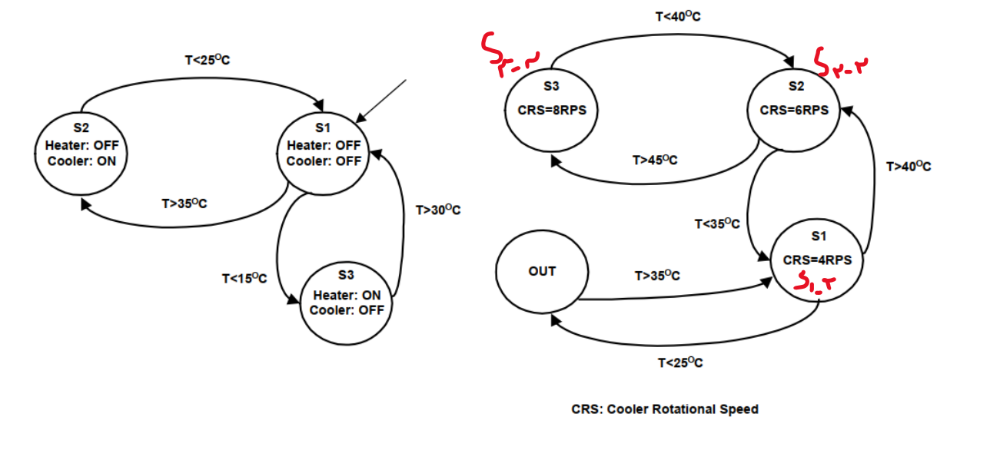
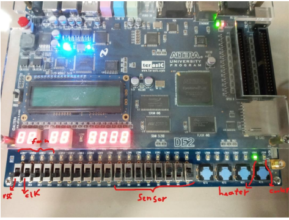
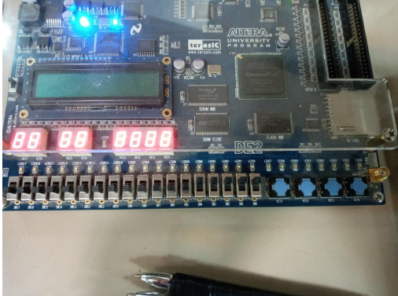
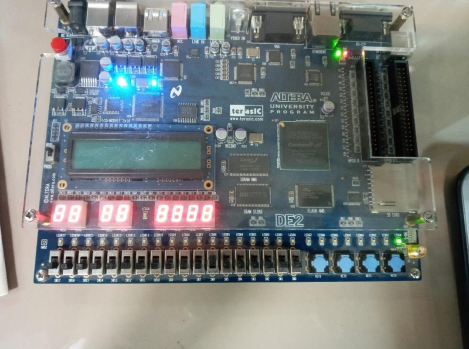
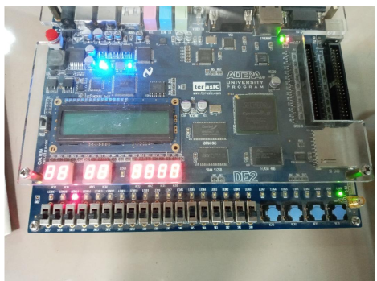
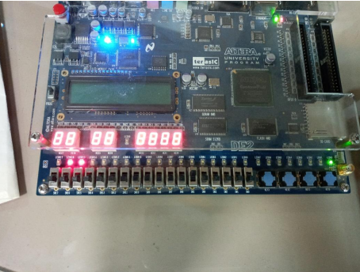

# Incubator Control System

This project implements a control system for an incubator, which regulates the temperature using a heater, cooler, and fan. The system continuously monitors the temperature using a sensor and adjusts the hardware based on the current temperature reading and the control logic.

## Features

- **Temperature Regulation**: The system activates or deactivates the heater, cooler, and fan based on the sensor's input.
- **Finite State Machine (FSM)**: The control system uses a state machine to determine which components should be active.
- **Fan Speed Control**: The fan's speed can be adjusted to 4 different levels based on the temperature.

## Inputs and Outputs

### Inputs:
- **sensor [7:0]**: A signed 8-bit input that represents the current temperature.
- **clk**: Clock signal to synchronize the state transitions.
- **rst**: Reset signal to initialize the system.

### Outputs:
- **heater**: A 1-bit output that turns the heater on or off.
- **cooler**: A 1-bit output that turns the cooler on or off.
- **fan [3:0]**: A 4-bit output that controls the fan's speed.

## State Machine

The incubator control system uses a finite state machine with the following states:

- **s1**: Idle state, where no action is taken.
- **s2**: Cooler is activated when the temperature exceeds 35.
- **s3**: Heater is activated when the temperature is below 15.
- **s1_2, s2_2, s3_2**: Intermediate states where the fan's speed is adjusted based on the temperature.
- **out**: A special state where additional logic is performed based on temperature thresholds.

## FSM Diagram

This diagram shows the transitions between the different states of the system based on the temperature readings.

## Example

Here’s an example of how the system behaves based on sensor readings:

- **Sensor = 31**: The system is in idle mode (`s1`).
- **Sensor = 64**: The cooler is turned on (`cooler = 1`), and the fan is set to 4 (`fan = 4`).
- **Sensor = 64**: The cooler remains on, and the fan speed increases to 6 (`fan = 6`).
- **Sensor = 64**: The cooler is still on, and the fan speed reaches 8 (`fan = 8`).

### State Transition Example

Below are the state transitions for the above example:
s1 -> s3 -> s1 -> s2 -> s1_2 -> s2_2 -> s3_2

Each transition corresponds to the control system adjusting the heater, cooler, and fan based on the temperature sensor input.

## How to Run

1. **Compile the Verilog code** using a simulator like ModelSim or Xilinx Vivado.
2. **Run the simulation** and provide test inputs for the `sensor` to observe how the heater, cooler, and fan respond.
3. **Analyze the outputs** to verify the correct operation of the incubator control system.

### State Transitions and Outputs

1. **Sensor = 31**: 
   - State: `s1 -> s3 -> s1`
   - Description: Initial sensor reading is 31.
   

2. **Sensor = 64, Cooler = 1**: 
   - State: `s2`
   - Description: The sensor value increases to 64, activating the cooler.
   

3. **Sensor = 64, Cooler = 1, Fan = 4**:
   - State: `s1_2`
   - Description: The fan speed is set to 4 as the temperature increases.
   

4. **Sensor = 64, Cooler = 1, Fan = 6**:
   - State: `s2_2`
   - Description: The fan speed increases to 6.
   

5. **Sensor = 64, Cooler = 1, Fan = 8**:
   - State: `s3_2`
   - Description: The fan reaches its maximum speed (8).
   

