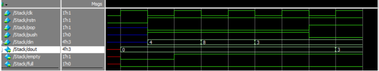
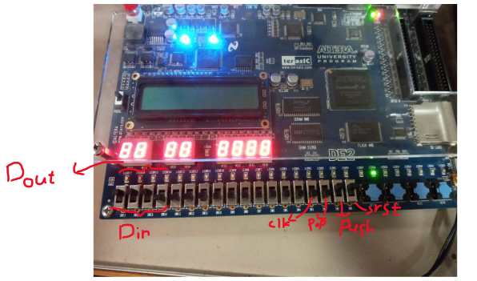
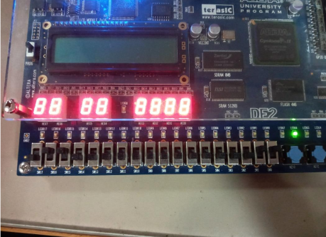
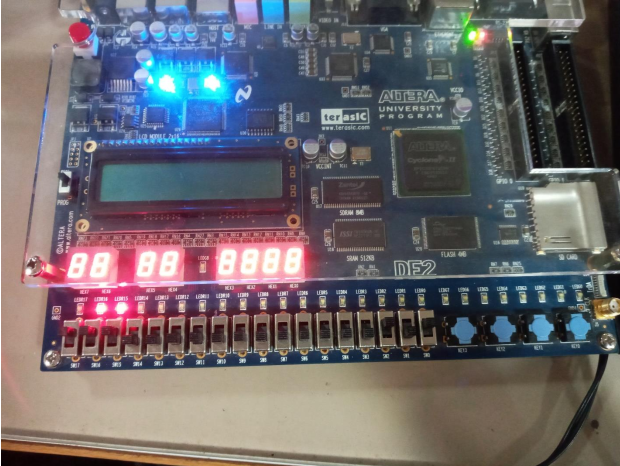

# Stack Module

This project implements a parameterized stack using Verilog. The stack is designed with configurable width and depth, allowing it to store data and provide basic stack operations such as push and pop. 

## Features

- **Parameterized Stack**: The stack can be customized by setting the `WIDTH` and `DEPTH` parameters.
- **Basic Operations**: Supports the following operations:
  - **Push**: Adds an element to the top of the stack.
  - **Pop**: Removes the element from the top of the stack.
- **Empty and Full Flags**: Provides flags to indicate if the stack is empty or full.

## Inputs and Outputs

### Inputs:
- **clk**: Clock signal for synchronizing the stack operations.
- **rstn**: Active-low reset signal to reset the stack.
- **push**: Signal to push data onto the stack.
- **pop**: Signal to pop data from the stack.
- **din [WIDTH-1:0]**: Data input to be pushed onto the stack.

### Outputs:
- **dout [WIDTH-1:0]**: Data output from the stack.
- **empty**: A flag that is high when the stack is empty.
- **full**: A flag that is high when the stack is full.

## How the Stack Works

1. **Push Operation**: When the `push` signal is asserted, the input data (`din`) is stored at the current stack index, and the index is incremented.
2. **Pop Operation**: When the `pop` signal is asserted, the data from the top of the stack is output (`dout`), and the index is decremented.
3. **Empty and Full Conditions**:
   - The stack is **empty** when the `index` is 0.
   - The stack is **full** when the `index` reaches the depth of the stack (defined by the `DEPTH` parameter).

## Example

Here’s an example of basic stack operations:

1. **Waveform (Simulation)**: Numbers 4, 8, and 3 are pushed onto the stack, and one value is popped:
   

2. **FPGA (Push Operation)**: The value `1110` is pushed onto the stack (observed on FPGA):
   

3. **FPGA (Push Operation)**: The value `0110` is pushed onto the stack (observed on FPGA):
   

4. **FPGA (Pop Operation)**: The top value is popped from the stack (observed on FPGA):
   

## Author

Ava Cyrus

